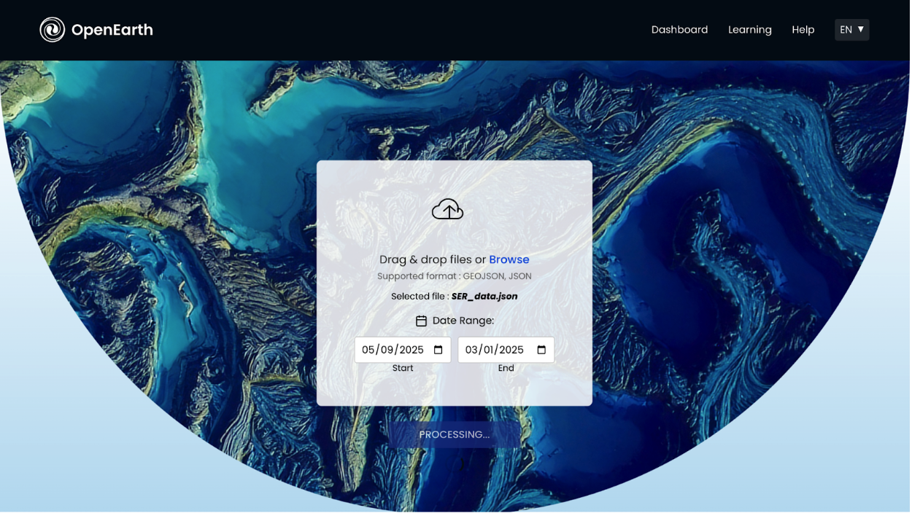
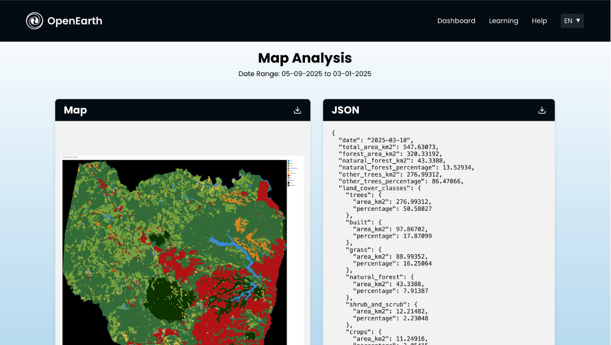

# GeoIntel – Forest Classification Platform

**Author:** Shristi
**Program:** MS Computer Science – Arizona State University

GeoIntel is a cloud-based geospatial analysis platform that performs **land usage classification and natural forest detection** using **Google Earth Engine (GEE)** and **AWS cloud services**.

The system allows users to upload geospatial boundary data (`data.json`), select a date range, and generate classification outputs through an interactive web interface.

---

# System Architecture


The system architecture consists of:

**Frontend**

* React application for user interaction
* Upload JSON boundary files
* Select date ranges
* Display classification results

**AWS Lambda**

* Runs classification logic
* Connects to Google Earth Engine
* Processes uploaded geospatial data

**Amazon S3**

* Stores uploaded JSON files
* Stores classification outputs
* Stores Lambda assets and credentials

**Google Earth Engine**

* Provides geospatial datasets
* Performs satellite-based land classification

**AWS CDK**

* Deploys the infrastructure as code

---

# Demo

### Upload Interface



Users upload a `data.json` file and select the analysis date range.

---

### Classification Result



The system generates classified land cover results and downloadable statistics.

---

# Key Features

* JSON-based geospatial boundary upload
* Satellite imagery classification using Google Earth Engine
* Cloud-based processing using AWS Lambda
* Automated infrastructure deployment via AWS CDK
* Visualization of classification results in the frontend
* Scalable architecture for geospatial analysis

---

# Technology Stack

**Frontend**

* React
* CRACO
* React Router

**Backend**

* AWS CDK
* TypeScript
* Python (Lambda)

**Cloud Services**

* AWS Lambda
* Amazon S3
* AWS IAM

**Geospatial Engine**

* Google Earth Engine

---

# Repository Structure

```
GeoIntel
│
├── backend
│   ├── bin
│   │   └── forest-classification.ts
│   ├── lambda
│   │   ├── lambda-function.py
│   │   └── lambda-function-code.zip
│   ├── lib
│   │   └── classification_stack.ts
│   ├── cdk.json
│   ├── package.json
│   ├── requirements.txt
│   └── tsconfig.json
│
├── frontend
│   ├── public
│   ├── src
│   │   ├── components
│   │   ├── pages
│   │   ├── utilities
│   │   ├── index.js
│   │   └── index.css
│   ├── build
│   ├── craco.config.js
│   └── package.json
│
├── images
│   ├── architecture.png
│   ├── demo-upload.png
│   └── demo-result.png
│
└── README.md
```

---

# Prerequisites

Before running the project ensure you have:

### AWS Account

Create an IAM user and configure the AWS CLI.

```
aws configure
```

---

### Node.js

```
node -v
npm -v
```

---

### Python

```
python3 --version
```

---

### AWS CDK

```
npm install -g aws-cdk
```

---

### Google Earth Engine

You must create a **GEE Service Account** and download the credentials file:

```
ee-credentials.json
```

---

# Setup Instructions

## Clone the Repository

```
git clone https://github.com/spatha29/GeoIntel.git
cd GeoIntel
```

---

# Frontend Setup

```
cd frontend
npm install
npm start
```

The application will run at:

```
http://localhost:3000
```

---

# Backend Setup

```
cd backend
npm install
pip install -r requirements.txt
```

---

# S3 Bucket Setup

Create an assets bucket:

```
aws s3 mb s3://your-assets-bucket
```

Upload required assets:

```
aws s3 cp lambda-function-code.zip s3://your-assets-bucket/
aws s3 cp ee-credentials.json s3://your-assets-bucket/credentials/
aws s3 cp layers/earth_engine_layer.zip s3://your-assets-bucket/layers/
aws s3 cp layers/image_processing.zip s3://your-assets-bucket/layers/
```

---

# Deploy Infrastructure

```
cd backend
cdk bootstrap
```

Deploy stack:

```
cdk deploy ForestClassificationStack \
--parameters AssetsBucketName=your-assets-bucket \
--parameters BucketName=your-input-output-bucket \
--parameters GeeCredentialsFile=ee-credentials.json
```

---

# Using the Application

1. Start the frontend
2. Upload a `data.json` file
3. Enter start and end dates
4. Submit the request
5. The system processes the data via AWS Lambda
6. Download the classification results

---

# Security Notes

* Do not commit GEE credentials
* Do not commit AWS keys
* Use IAM roles with least privilege
* Block public access to credential buckets

---


GeoIntel – Cloud-Based Geospatial Intelligence Platform
